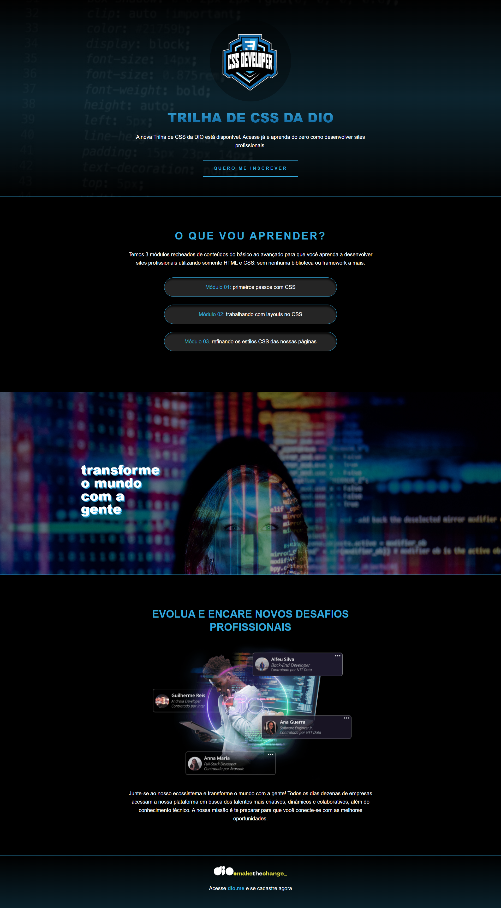

## 🏋️‍♂️ Desafio de Projeto HTML e CSS: Criando uma landing page com HTML e CSS.

Desafio de projeto proposto no curso de Formação CSS Web Developer para criação de uma landing page.  
Os temas abordados são:   
- As propriedades básicas da linguagem de estilização.
- Estruturação e formatação de texto.
- As unidades de medidas relativas e absolutas. 

Além de outros recursos.

## 💻 Tecnologias utilizadas nesse projeto:

  
  

## 💻 Preview:
- Veja como ficou o projeto acessando: [nesse link do Github Pages](https://ernandesneponuceno.github.io/Criando-Landing-Page-com-HTML-e-CSS/)
  

## 🤔 O que aprendi com esse projeto:
- Aprimorar minhas habilidades em HTML e CSS.
- Utilizar os recursos disponibilizados como base para a atividade.
- Estilização de texto, posição e boas práticas de design.
- Utilização de padding, margin, background, object-fit, display, flex-direction, dentre outros recursos.

## 📌 Créditos
- **Assets:** Disponível no protótipo do Figma disponibilizado no curso.
- **Link do Github com instruções da atividade:**(https://github.com/digitalinnovationone/trilha-css-desafio-01)
